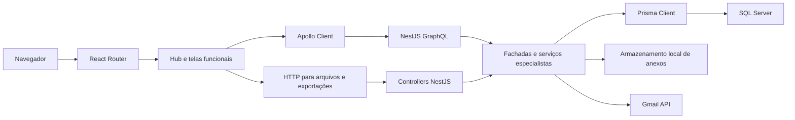
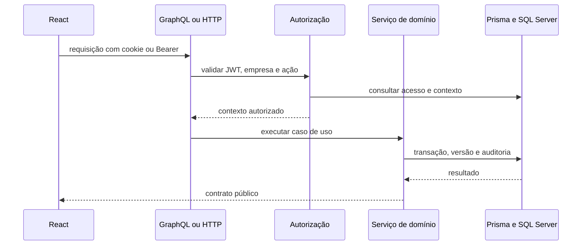

# Arquitetura

## Visão de componentes



## Backend

O backend é iniciado em [`server/src/main.ts`](../server/src/main.ts). Ele
aplica `cookie-parser`, validação global, CORS com credenciais e escuta em
`0.0.0.0`.

O [`AppModule`](../server/src/app.module.ts) integra configuração,
GraphQL/Apollo, Prisma e os módulos de usuários, grupos, empresas, soluções,
autenticação, chamados, projetos e serviços.

### Camadas adotadas

1. **Resolver/controller**: traduz GraphQL ou HTTP para chamadas de aplicação.
2. **Fachada**: mantém o contrato público estável e delega responsabilidades.
3. **Serviço especialista**: implementa um caso de uso ou domínio específico.
4. **Autorização/policy**: valida empresa, papel, ação e transição.
5. **Prisma**: executa persistência e transações.
6. **Mapper/DTO/type**: delimita entrada, saída e transformação.

`ProjetosService`, `ChamadosService`, `UsersService`, `EmpresasService`,
`SolucoesService` e `GruposUsuariosService` devem permanecer fachadas finas.
Novos comportamentos devem ser adicionados preferencialmente aos serviços
especialistas.

### GraphQL

O schema é code-first e é materializado em
[`server/src/schema.gql`](../server/src/schema.gql). Em ambiente diferente de
produção, introspecção e Playground ficam habilitados.

Resolvers autenticados usam `GqlAuthGuard`; controllers HTTP protegidos usam
`AuthGuard('jwt')`.

### Persistência

O [`schema.prisma`](../server/prisma/schema.prisma) usa SQL Server. Regras
importantes são reforçadas por chaves únicas, índices, arquivamento lógico,
transações e versões para concorrência otimista. As migrations são a fonte de
verdade histórica do banco.

## Frontend

O frontend inicia em [`client/src/main.jsx`](../client/src/main.jsx) e combina
`ApolloProvider`, `AuthProvider`, `RouterProvider` e rotas públicas/protegidas.

As páginas protegidas são organizadas pelo Hub:

```text
/hub
/hub/:slug
/hub/:slug/:areaSlug
/hub/:slug/:areaSlug/:itemId
```

O backend devolve a navegação permitida. O
[`hubConfig.js`](../client/src/auth/hubConfig.js) converte a chave de registro
em uma chave de componente, e
[`SolutionFeaturePage.jsx`](../client/src/pages/SolutionFeaturePage.jsx)
seleciona a tela. A checagem frontend não substitui a autorização do backend.

## Fluxo de uma operação autenticada



## Decisões estruturais

- Empresa ativa é parte do contexto de autorização.
- A autorização do backend é a fonte de verdade.
- Acesso ao Hub combina catálogo, empresa, grupo, funcionalidade e ação.
- Registros padrão do sistema possuem proteção especial.
- Arquivos ficam fora do banco; somente metadados e caminho são persistidos.
- Histórico e auditoria não devem ser substituídos por exclusão física.
- Contratos GraphQL públicos devem permanecer estáveis durante refatorações.
- Serviços especialistas devem ser preferidos a fachadas crescentes.
