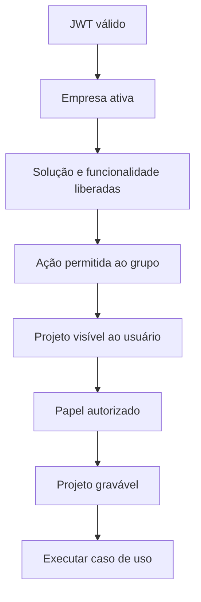

# Fundação operacional de Projetos

## Princípios

1. Toda operação pertence a uma empresa ativa.
2. Usuário comum só enxerga projeto do qual participa.
3. Papel no projeto e permissão funcional são condições independentes.
4. Backend é a autoridade final.
5. Projeto arquivado é consultável e somente leitura.
6. Mutações relevantes são auditáveis.
7. Alterações compostas são transacionais.
8. Concorrência não deve sobrescrever silenciosamente outra alteração.

## Serviços centrais

| Serviço | Contrato |
|---|---|
| `ProjetoAuthorizationService` | Empresa, feature/action, visibilidade, papel e arquivamento. |
| `ProjetoAuditoriaService` | Registro uniforme em `ProjetoEvento`. |
| `ProjetoSequenciaService` | Reserva número por projeto e namespace. |
| `ProjetoIdempotenciaService` | Reuso seguro de uma operação pela mesma chave. |
| `ProjetoPeriodoService` | Período, duração em minutos e paginação. |
| `ProjetoKeyService` | Normalização e sugestão da chave do projeto. |

## Autorização em camadas

O administrador do sistema ignora papel e permissão funcional nas regras
atuais. O grupo com acesso integral ignora o catálogo funcional, mas continua
sujeito à participação no projeto porque não é administrador do sistema.

## Visibilidade

Para usuário comum, `visibilityWhere` restringe a projetos em que ele é
responsável ou está em `ProjetoMembro`. A consulta detalhada devolve registro
inexistente quando a empresa ou participação não corresponde, evitando
vazamento de existência.

## Arquivamento

`arquivadoEm` preserva o projeto e seu histórico. Consultas continuam
permitidas; `assertWritableProject` impede mutações operacionais. Reativação é
uma ação explícita do cadastro de projetos.

## Auditoria

`ProjetoEvento` registra:

- empresa;
- projeto;
- usuário, quando disponível;
- tipo de entidade;
- identificador da entidade;
- evento;
- dados adicionais serializados;
- instante de criação.

A auditoria deve ocorrer na mesma transação da alteração sempre que possível.
Não grave credenciais ou binários no campo de dados.

## Sequenciamento

`ProjetoSequencia` usa chave única entre projeto e namespace. A reserva deve
ser executada em transação. Itens usam esse mecanismo para manter número e
chave imutáveis por projeto.

## Idempotência

O escopo é projeto, usuário, operação e chave. O payload é serializado de
forma estável e recebe SHA-256.

Comportamento:

- mesma chave e mesmo payload concluído: reutiliza a resposta;
- mesma chave e payload diferente: conflito;
- operação ainda processando: conflito;
- operação anterior com falha: pode voltar a processar;
- sucesso e erro ficam persistidos.

A chave de idempotência não substitui transação nem versão.

## Concorrência otimista

Entidades mutáveis operacionais carregam `versao`. O padrão é executar
`updateMany` ou `deleteMany` com `id`, escopo e versão esperada. Quantidade
diferente de um gera conflito e obriga o cliente a recarregar.

O backlog usa `backlogVersao` no projeto porque a ordenação é uma coleção, não
apenas um item.

## Transações

Uma mutação que altera entidade, vínculos e auditoria deve ser atômica.
Exemplos:

- criar item e incrementar versão do backlog;
- alterar escopo da sprint e registrar evento;
- editar atualização e guardar versão anterior;
- aprovar orçamento e auditar a mudança.

## Serviços especialistas

Cada módulo operacional possui serviço de autorização próprio, mas delega os
pré-requisitos comuns ao `ProjetoAuthorizationService`. Isso evita acoplamento
ao slug fixo do cadastro e mantém a fachada pública estável.

## Contratos públicos

- Prisma define persistência e índices.
- DTOs GraphQL validam entrada.
- tipos GraphQL expõem dados e permissões efetivas.
- serviços frontend adaptam o transporte.
- componentes não devem reconstruir autorização de backend.

Novos módulos devem seguir os contratos descritos em
[Contratos operacionais](contratos-operacionais.md) e acrescentar evidências à
[Matriz de evidências](matriz-evidencias.md).
